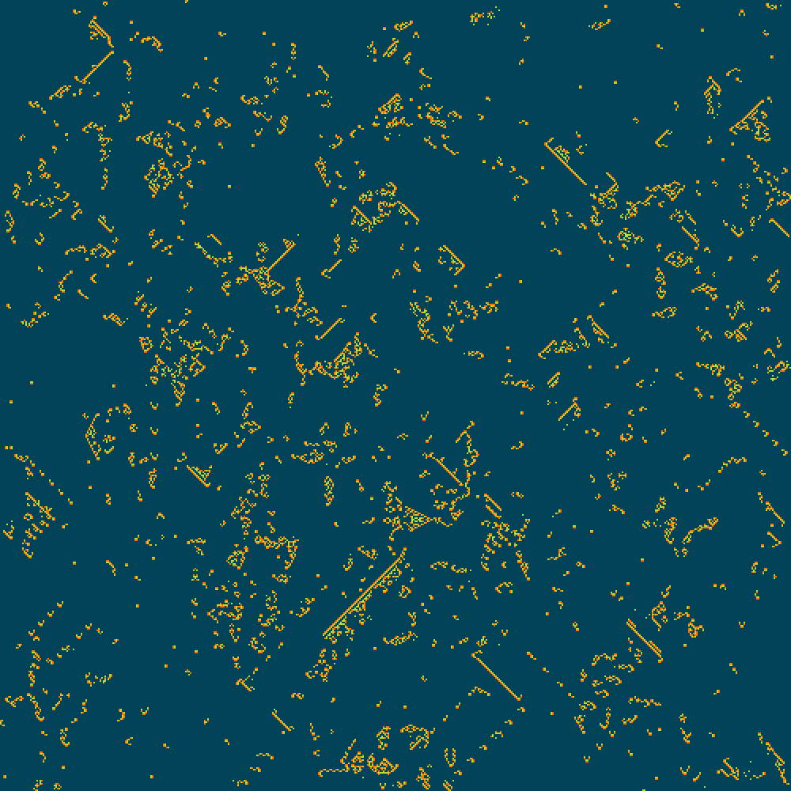

# Brain: 2D cellular automaton

Three types of cells: passive, active, cooldown.

- active becomes cooldown
- cooldown becomes passive
- passive becomes active if it has exactly two active neighbours

