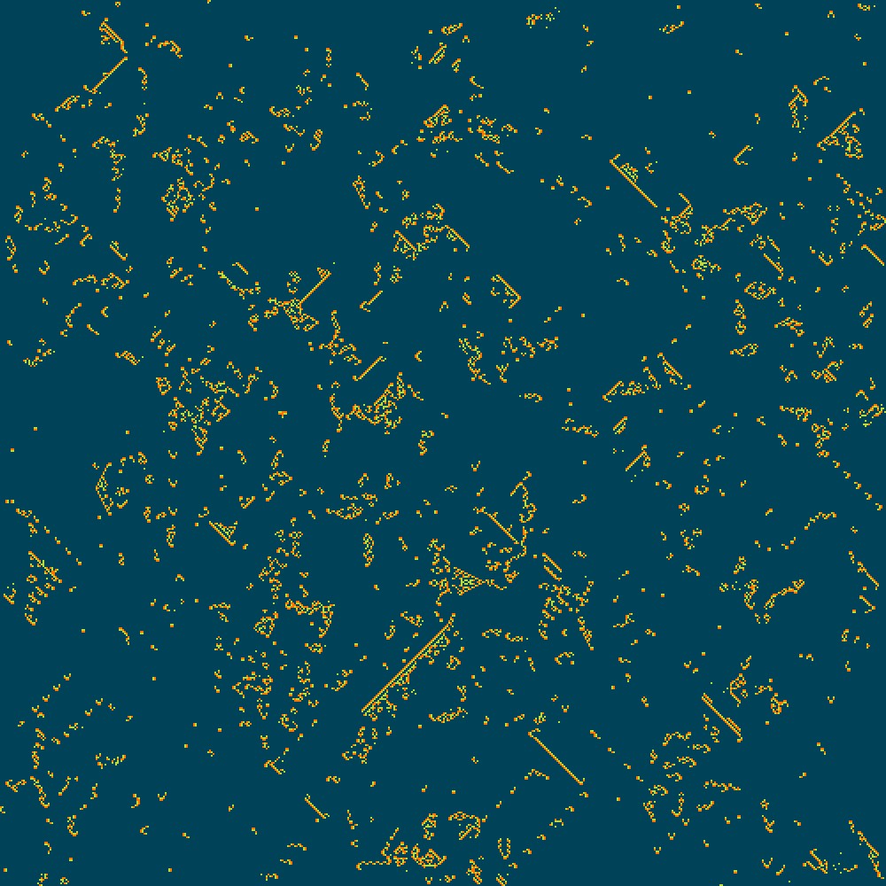

# Brian's Brain

A 2D cellular automaton simulation implementing **Brian's Brain**, a cellular automaton devised by Brian Silverman.

## About

Brian's Brain is a three-state cellular automaton that produces complex, brain-like patterns from simple rules. The simulation starts with a sparse random seed and evolves into intricate wave-like structures.

## Rules

Each cell exists in one of three states:

| State      | Color        | Transition                                   |
|------------|--------------|----------------------------------------------|
| Active     | Orange       | Becomes cooldown in the next generation      |
| Cooldown   | Yellow-green | Becomes passive in the next generation       |
| Passive    | Dark cyan    | Becomes active if exactly 2 neighbors are active |

The rules create self-propagating patterns where "waves" of activity travel across the grid.

## Installation

```bash
pip install numpy pygame
```

## Usage

```bash
python brain.py
```

Close the window to exit.

### Command-line Options

| Flag | Long form      | Default      | Description                                |
|------|----------------|--------------|--------------------------------------------|
| `-s` | `--size`          | 500          | Grid size (N × N cells)                    |
| `-z` | `--zoom`           | 1000 // SIZE | Display zoom factor                        |
| `-i` | `--init-p-active`  | 0.004        | Initial probability of a cell being active |
| `-f` | `--framerate`  | 30           | Target frames per second                   |
| `-g` | `--generations`| 0            | Exit after N generations (0 = indefinite)  |
| `-p` | `--picture`    |              | Save final screenshot to FILE              |

Examples:

```bash
# Run with defaults
python brain.py

# Larger grid with higher framerate
python brain.py -s 800 -f 60

# Custom zoom and initial density
python brain.py --size 300 --zoom 2 --init-p-active 0.01

# Run for 1000 generations and save screenshot
python brain.py -g 1000 -p output.png
```

## Requirements

- Python 3
- NumPy
- Pygame

## Screenshot



## License

BSD 2-Clause
